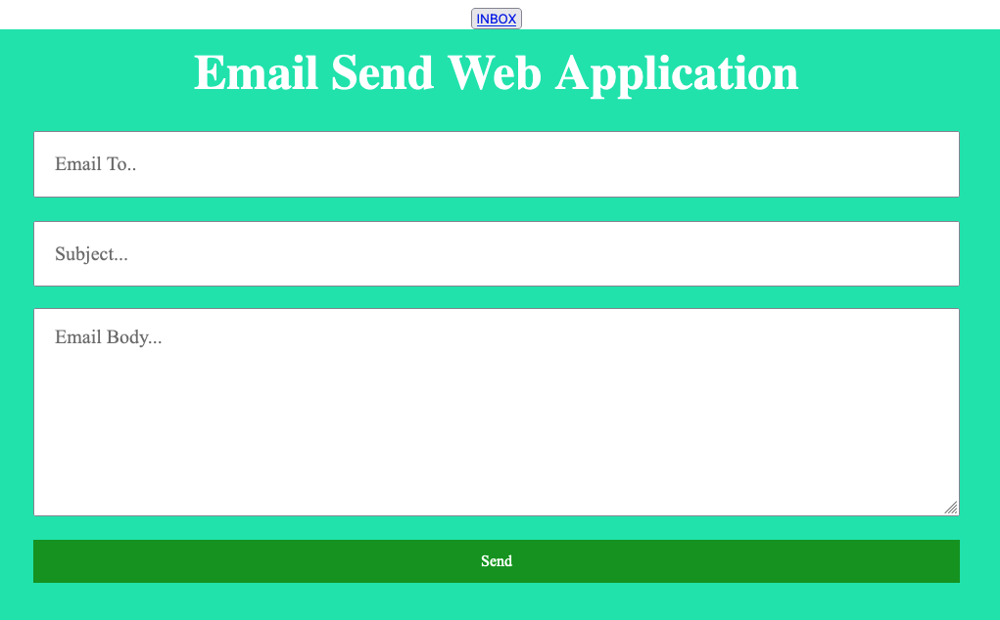

# Project Title:

Java Email System Web Application


## 1. Project Description:

An email system to send and receive mails using Java JSP / servlet technology and JavaMail API.


## 2. Tech Stack:

- HTML / CSS / Bootstrap / JS

- Java 11

- Jakarta EE

- JSP / Servlet

- GMail Account (SMTP)

- Apache 10 Server

- Maven


## 3. Installation:

> I mistakenly created a web project instead of a maven web project, so this project will only 
display the landing page if you clone and run. It will not send or receive emails.
To get email to work, create a maven web project, then add the files in the repo and 
dependencies to your project. Have fun. 😎

Git repo:

```
https://github.com/AAdewunmi/Java-Email-System-Web-App.git
```

[Netbeans - How to convert java web application project to Maven project in Netbeans](https://www.youtube.com/watch?v=XaumVyY4vYM) 


## 4. Maven Dependencies:

```
<!-- https://mvnrepository.com/artifact/javax.mail/mail -->
<dependency>
    <groupId>javax.mail</groupId>
    <artifactId>mail</artifactId>
    <version>1.5.0-b01</version>
</dependency>

```

```
<!-- https://mvnrepository.com/artifact/javax.ejb/ejb-api -->
<dependency>
    <groupId>javax.ejb</groupId>
    <artifactId>ejb-api</artifactId>
    <version>3.0-alpha-1</version>
    <scope>provided</scope>
</dependency>
```


## 5. How To Use:

Add the following:

```
Path to password.txt file
Your gmail address 
```
to to EmailUtility.java and MailService.java


## 6. Demo:




## 7. Contributing:

Pull requests are welcome. For major changes, please open an issue first to discuss what you would like to change.


## 8. Adapted from: 

UDEMY: Java Development Mega Course: Build Projects Practically

(Java Programming Course: Learn Development of JAVA Projects Using JSP, JDBC, Servlets, Swing, Spring Boot, Maven, Hibernate)

Project Name: Project 41: Email System Web App

Created by: Engineering.Org.In

Last updated: 09/2022

URL: https://www.udemy.com/course/build-real-world-java-projects-using-spring-jsp-jdbc/


